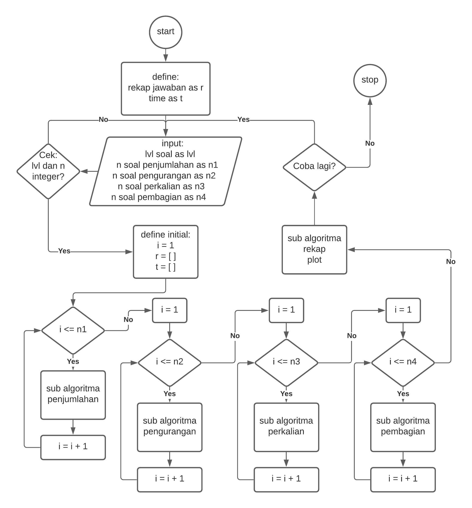
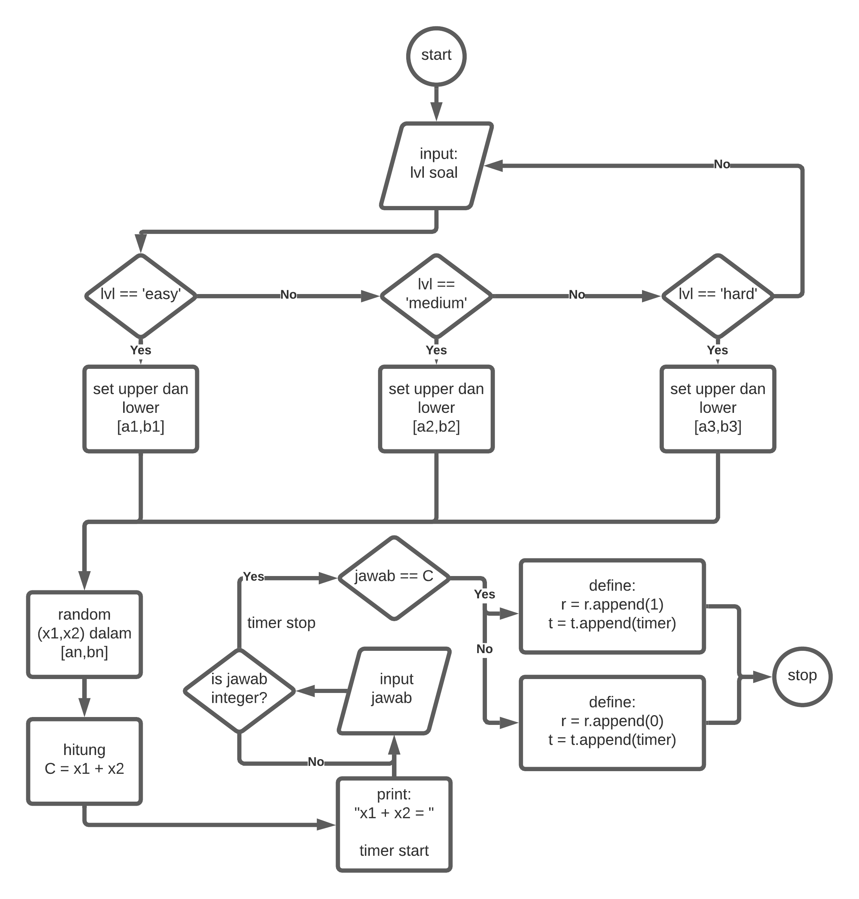
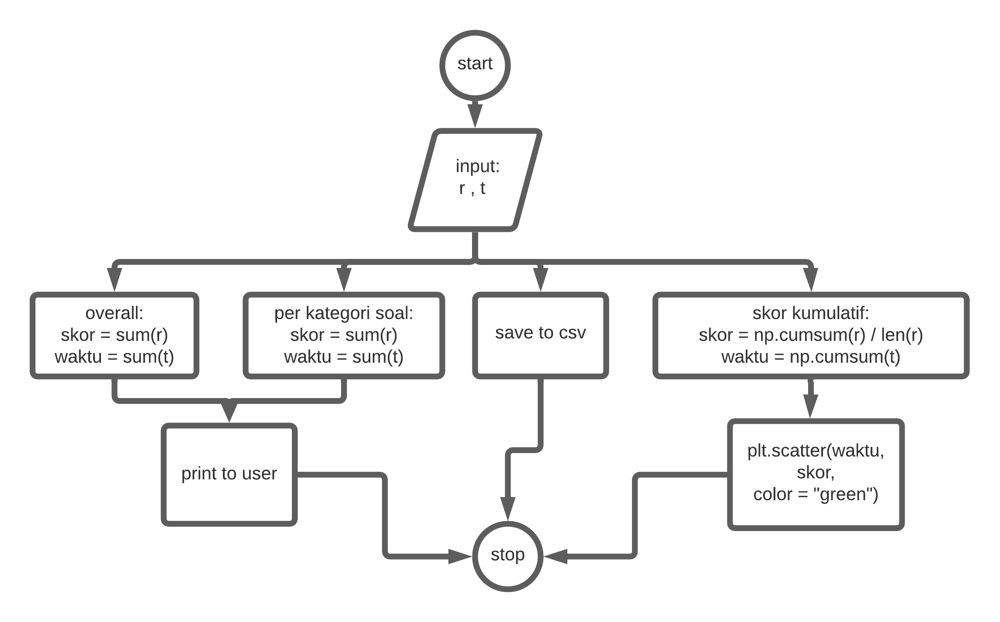
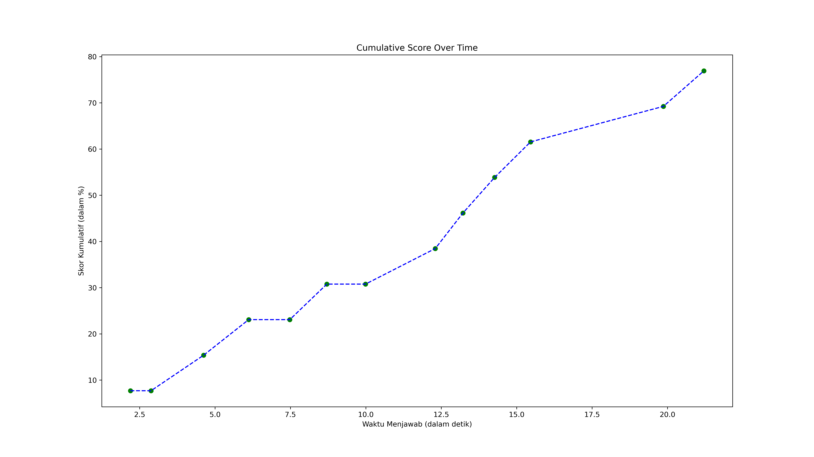
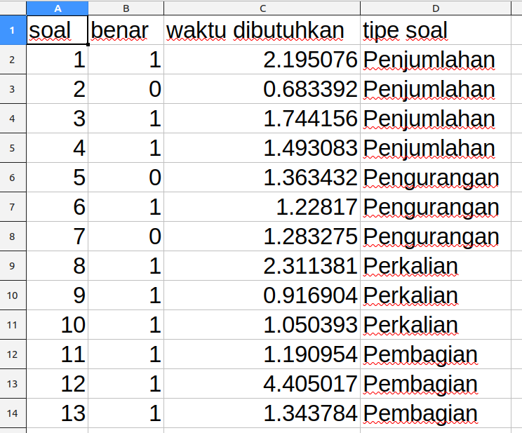

```{r,include=FALSE}
rm(list=ls())
library(dplyr)
```

## Abstrak

Anak-anak generasi _alpha_ (kelahiran 2011 - 2025) adalah generasi yang akrab dengan dunia _digital_ dan teknologi (_digital natives_) (McCrindle, 2020). Mereka terlahir dengan berbagai teknologi yang sudah maju beserta segala kemudahannya. Pandemi yang datang secara mendadak mau tidak mau harus mengubah cara orang tua dan guru untuk mengajarkan materi pelajaran seperti berhitung. Program _math gamse for kids_ menawarkan kemudahan baik bagi orang tua, guru, dan anak dalam hal memberikan soal latihan sekaligus melakukan evaluasi secara otomatis. Program ini dibuat menggunakan bahasa _Python_ yang sudah populer dalam dunia _programming_ dan edukasi.

\newpage

# PENDAHULUAN

## Latar Belakang

Anak kelas 3 - 4 SD diharapkan sudah bisa mengerjakan soal penjumlahan, pengurangan, perkalian, dan pembagian yang sederhana. Untuk itu, mereka perlu mendapatkan latihan soal yang cukup. Sejak memasuki masa pandemi __Covid 19__, metode pendidikan berubah ke arah latihan mandiri, dengan kendala-kendala yang sering ditemui sebagai berikut:

- Buku pelajaran dan latihan soal yang terbatas,
- Keterbatasan guru atau orang tua dalam mengecek pekerjaan siswa,
- Tingginya distraksi dari aktivitas lain seperti _video game_ terutama untuk generasi _alpha_ yang sangat fasih terhadap teknologi.

Oleh karena itu, muncul ide untuk membuat suatu program yang bisa membuat soal latihan berhitung secara _random_ dan otomatis dengan tingkat kesulitan soal yang dapat disesuaikan. Sehingga akan tercipta soal latihan tidak terbatas banyaknya. Selain itu diharapkan anak menjadi senang karena akan terlihat seperti bermain _game_ di komputer atau _gadget_. 

## Tujuan

Membuat program yang dapat membuat soal latihan berhitung dengan sifat-sifat sebagai berikut:

1. Soal dibuat dengan _random_,
1. Soal dibuat secara otomatis,
1. Tingkat kesulitan soal dapat disesuaikan,
1. Proses evaluasi soal dilakukan secara otomatis.

## Limitasi Penelitian

Program ini ditujukan kepada anak kelas 3 - 4 SD. Oleh karena itu, setiap bilangan yang ada di soal merupakan __bilangan__ ___integer___ (bulat).

## Metode

Program akan dibuat menggunakan bahasa pemrograman _Python_ versi 3 dengan memanfaatkan beberapa _libraries_ tambahan.

## Target _Output_ Penelitian

Penelitian ini diharapkan akan menghasilkan suatu program yang dapat dijalankan di komputer atau _gadget_ berbasis _Python_ sebagai _interpreter_-nya. Untuk itu, kami membuat dua tahapan pengerjaan, yakni:

- __TAHAP I__ berupa program dalam bentuk _command line interface_ (__CLI__). Program ini memiliki semua minimal fitur yang dibutuhkan seperti:
    - _Generate random_ soal,
    - Evaluasi jawaban anak,
    - _Plot_ evaluasi dalam grafik,
    - Penyimpanan rekap jawaban anak dalam suatu file berformat `.csv`.
- __TAHAP II__ berupa program dalam bentuk _graphical user interface_ (__GUI__).
    - Fitur yang dimiliki:
        - _Generate random_ soal,
        - Evaluasi jawaban anak,
        - _Sound effects_ saat jawaban benar atau salah.
    - Fitur yang belum dimiliki:
        - _Plot_ evaluasi dalam grafik,
        - Penyimpanan rekap jawaban anak dalam suatu file berformat `.csv`.

\newpage

# RINGKASAN STUDI PUSTAKA

## _Games_ Edukasi Anak

Sampai dengan saat ini, sudah banyak _games_ anak yang edukatif dan melatih kemampuan matematika seperti:

```{r,echo=FALSE}
game = c("Mencocokkan","Misteri","Strategi spasial","Strategi angka","Manajemen sumber daya")
contoh = c("Go Fish & Domino","Tebak-tebakan","Catur & Battleship","Uno & Mancala","Monopoli")
kemampuan = c("Memori","Logika","Memori, logika, & spasial","Aritmatika & identifikasi angka","Aritmatika & manajemen")

data.frame(game,contoh,kemampuan) %>% 
  rename("Jenis games" = game,
         "Contoh games" = contoh,
         "Kemampuan yang Dilatih" = kemampuan) %>% 
  knitr::kable(caption = "sumber: understood.org")
```

Seiring dengan waktu, permainan berbasis komputasi mulai dibuat dan berkembang dengan sangat pesat. Perkembangan ini sedikit banyak disebabkan oleh semakin banyaknya bahasa pemograman dengan berbagai kemampuan baru yang ditawarkan untuk membangun permainan komputer yang lebih menarik.

Bermain _game_ matematika mendukung berpikir strategis, menyelesaikan masalah, dan meningkatkan kelancaran dalam mengerjakan soal^[https://www.stem.org.uk]. Di Indonesia sendiri, telah diimplementasikan __Ujian Nasional Berbasis Komputer__ (__UNBK__) sebagai salah satu syarat kelulusan. Siswa tidak hanya perlu untuk memahami pelajaran, tetapi juga harus terbiasa mengerjakan soal menggunakan komputer^[unbk.kemendikbud.com]. Oleh karena itu prilaku terbiasa mengerjakan soal di komputer perlu dilatih karena akan sangat membantu kelancaran dan ketenangan siswa dalam menyelesaikan ujian.

## Python

Bahasa yang digunakan untuk membuat _game_ ini adalah _Python_. Disebut demikian karena pembuat bahasa tersebut adalah penggemar serial televisi Inggris ___Monty Python___. _Python_ populer dalam pengembangan _game_, selain pengembangan aplikasi hingga situs _web_. Bahkan __NASA__ dan __Google__ sangat bergantung pada _Python_ (McGuggan, 2007). Game populer seperti _Snakes_, _Flappy Bird_, _Tetris_, _Battlefield 2_, _The Sims 4_, _World of Tanks_, _Disney Toontown Online_ dan masih banyak lagi menggunakan bahasa _Python_ untuk membuatnya^[Wikipedia].

Beberapa _libraries_ lain yang digunakan pada penyusunan program ini antara lain:

1. `random`: digunakan untuk mendapatkan _function_ `randint()`. _Function_ ini berguna untuk _generate_ bilangan _integer_.
1. `datetime`: digunakan untuk mendapatkan function `datetime.now()`. _Function_ ini berguna untuk mendapatkan waktu saat suatu perintah di-eksekusi. Kelak kita akan menghitung durasi anak menjawab sebuah soal.
1. `matplotlib`: digunakan untuk membuat dan menyimpan grafik rekap jawaban anak.
1. `numpy`: digunakan untuk menghitung dan merekap evaluasi jawaban anak.
1. `pygames`: digunakan untuk membuat __GUI__ _games_.

## Prinsip Komputasi

Beberapa prinsip komputasi di Python yang digunakan antara lain:

- _Function_
    - Digunakan untuk memecah keseluruhan algoritma menjadi beberapa sub modul (sub algoritma) kecil sehingga lebih _manageable_.
- _Looping_
    - `for()` – digunakan untuk generate n-buah soal.
    - `while()` – digunakan untuk memastikan bahwa _input_ yang dimasukkan berupa _integer_. Jika tidak, program akan meminta _user_ untuk memasukkan _input_ kembali.
- _Conditional_
    - Untuk mengecek jawaban anak.
- _Data storage_
    - Menyimpan rekap jawaban.
- Visualisasi data

\newpage

# HASIL PENELITIAN
## Program Versi CLI

### _Flowchart Utama_

Berikut adalah _flowchart_ dari program ini:

```{r,echo=FALSE,fig.retina=10,fig.align='center',fig.cap="Flowchart Utama"}

```

\newpage
### _Flowchart Sub Algoritma_

Berikut adalah _flowchart_ dari semua sub algoritma yang ada. Khusus pada _flowchart_ penjumlahan, pengurangan, perkalian, dan pembagian: __angka__ ___random__ __yang dibuat oleh__ ___function___ `randint()` __adalah bilangan bulat__.

```{r,echo=FALSE,fig.retina=10,fig.align='center',fig.cap="Flowchart Penjumlahan"}

```

\newpage

```{r,echo=FALSE,fig.retina=10,fig.align='center',fig.cap="Flowchart Pengurangan"}

```

\newpage

```{r,echo=FALSE,fig.retina=10,fig.align='center',fig.cap="Flowchart Perkalian"}

```

\newpage

```{r,echo=FALSE,fig.retina=10,fig.align='center',fig.cap="Flowchart Pembagian"}

```

\newpage

```{r,echo=FALSE,fig.retina=10,fig.align='center',fig.cap="Flowchart Rekap dan Plot"}

```

\newpage

_Codes_ dari program ini disimpan dalam dua _files_, yakni:

1. `program.py` berisi _codes_ dari _flowchart_ utama dan semua _flowchart_ sub algoritma.
1. `main.py` merupakan program yang akan dieksekusi oleh _Python3_ saat:
    - Anak mengeksekusi program __pertama kali__, ATAU
    - Anak mau __mencoba kembali__ setelah menyelesaikan keseluruhan rangkaian soal.

Isi dari `main.py` adalah sebagai berikut:

```
# set initial condition
lagi = "y"
# menanyakan apakah user mau coba lagi?
while lagi == "y" or lagi == "Y":
  exec(open("program.py").read())
  lagi = input("Coba lagi? (y/n)")
print("==== Terima kasih ====")
```

Kedua _files_ ini akan dilampirkan dalam laporan ini dan dapat diakses di halaman _Github Repository_ berikut: https://github.com/ikanx101/RBL-SK5003

### Contoh _Output_ dari Program CLI

Berikut adalah contoh grafik rekap jawaban anak:

```{r,echo=FALSE,fig.retina=10,fig.align='center',fig.cap="Contoh Plot Rekap Jawaban"}

```

Berikut adalah contoh file `.csv` dari jawaban anak:

```{r,echo=FALSE,fig.retina=10,fig.align='center',fig.cap="Contoh csv Data Rekap Jawaban"}

```

\newpage

# REFERENSI

[1] McCrindle, M., Fell, A. (2020) Understanding Generation Alpha. McCrindle Research Pty Ldt.

[2] McGugan, Will (2007) Beginning Game Development with Python dan Pygame from Novice to Professional. Apress.

\newpage

# LAMPIRAN

## _Codes_ __program.py__

```
"""
=================================
RESEARCH-BASED LEARNING
SK5003 - PEMROGRAMAN DALAM SAINS
=================================

Kelompok RBL 2
20921003 - Winda Wijayasari
20921004 - Mohammad Rizka Fadhli

Program ini bertujuan utk generating random soal
berhitung untuk anak-anak kelas 2-4 SD.
"""

# ==============================================================
# penentuan level berdasarkan angka yang akan digenerate:
  # penjumlahan dan pengurangan: 
    # easy: 1-30
    # medium: 30 - 70
    # hard: 70 - 929
  # perkalian dan pembagian:
    # easy: 1-8
    # medium: 4-12
    # hard: 8-20
# ==============================================================

# fungsi untuk clear halaman
def clear():
  for i in range(0,10):
    print("\n\n")


# import fungsi yang dibutuhkan
from random import randint # digunakan untuk melihat waktu
import datetime # untuk melihat waktu
import matplotlib.pyplot as plt # untuk melakukan plot
import numpy as np


clear()
print('Halo,\n\nSelamat datang di program generator soal Matematika di Python.\nUntuk memulai, silakan masukkan level kesulitan yang diinginkan:\n')

# fungsi level
# ini masih sederhana ya utk penjumlahan terlebih dahulu
def level():
  print('Level kesulitan soal:\n1. easy\n2. medium\n3. hard\n\n(Masukkan angka level)\n\n')
  # digunakan untuk mengecek apakah inputnya berupa integer atau tidak
  marker = True
  while marker:
   try:
    lvl = int(input("level: "))
    if lvl > 3 or lvl < 1:
      marker = True
      print("Masukkan angka sesuai instruksi")
    else: break
   except ValueError:
    print("Format input salah. Masukkan angka sesuai instruksi.\n\n")

  if lvl == 1:
     x1 = 1
     x2 = 30
     x3 = 1
     x4 = 8
  if lvl == 2:
     x1 = 30
     x2 = 70
     x3 = 4
     x4 = 12
  if lvl == 3:
     x1 = 70
     x2 = 200
     x3 = 8
     x4 = 20
  out = [x1,x2,x3,x4]
  return(out)

# fungsi untuk menentukan n soal
def n_soal():
  # memastikan bahwa hanya bleh masuk n berupa integer > 0
  marker = True
  while marker:
   try:
    n = int(input("Banyaknya soal yang mau dikerjakan: "))
    if n < 0:
      marker = True
      print("Masukkan angka bilangan bulat positif.\n\n")
    else: break
   except ValueError:
    print("Masukkan angka sesuai instruksi (bilangan bulat).\n\n")
  return(n)

# fungsi penjumlahan
def jumlah(x1,x2) :
  a = randint(x1,x2)
  b = randint(x1,x2)
  c = a + b
  print(a, ' + ', b, ' = ')
  now = datetime.datetime.now()
  
  # memastikan agar hanya integer yang boleh diinput
  marker = True
  while marker:
   try:
    jawab = int(input("jawab: "))
    break
   except ValueError:
    print("Masukkan hanya angka!\n")
  
  end = datetime.datetime.now()
  time_delta = end-now
  total_waktu = time_delta.total_seconds()
  jawab = int(jawab)
  if c == jawab :
     cek = 1
     # print(cek)
  else :
     cek = 0
     # print(cek)
  return(cek,total_waktu)

# fungsi pengurangan
def kurang(x1,x2) :
  a = randint(x1,x2)
  b = randint(x1,x2)
  c = a + b
  print(c, ' - ', a, ' = ')
  now = datetime.datetime.now()
  
  # memastikan agar hanya integer yang boleh diinput
  marker = True
  while marker:
   try:
    jawab = int(input("jawab: "))
    break
   except ValueError:
    print("Masukkan hanya angka!\n")
    
  end = datetime.datetime.now()
  time_delta = end-now
  total_waktu = time_delta.total_seconds()
  jawab = int(jawab)
  if b == jawab :
     cek = 1
     # print(cek)
  else :
     cek = 0
     # print(cek)
  return(cek,total_waktu)

# fungsi perkalian
def kali(x3,x4) :
  a = randint(x3,x4)
  b = randint(x3,x4)
  c = a * b
  print(a, ' x ', b, ' = ')
  now = datetime.datetime.now()
  
  # memastikan agar hanya integer yang boleh diinput
  marker = True
  while marker:
   try:
    jawab = int(input("jawab: "))
    break
   except ValueError:
    print("Masukkan hanya angka!\n")
    
  end = datetime.datetime.now()
  time_delta = end-now
  total_waktu = time_delta.total_seconds()
  jawab = int(jawab)
  if c == jawab :
     cek = 1
     # print(cek)
  else :
     cek = 0
     # print(cek)
  return(cek,total_waktu)

# fungsi pembagian
def bagi(x3,x4) :
  a = randint(x3,x4)
  b = randint(x3,x4)
  c = a * b
  print(c, ' : ', a, ' = ')
  now = datetime.datetime.now()
  
  # memastikan agar hanya integer yang boleh diinput
  marker = True
  while marker:
   try:
    jawab = int(input("jawab: "))
    break
   except ValueError:
    print("Masukkan hanya angka!\n")
    
  end = datetime.datetime.now()
  time_delta = end-now
  total_waktu = time_delta.total_seconds()
  jawab = int(jawab)
  if b == jawab :
     cek = 1
     # print(cek)
  else :
     cek = 0
     # print(cek)
  return(cek,total_waktu)


# =========================================
# tampilannya mulai dari sini

# penentuan level kesulitan
lv = level()

# bikin array untuk rekap
benar = [] # berapa banyak jawaban benar
waktu = [] # waktu yang dibutuhkan
tipe_soal = [] # tipe soal


# menentukan seberapa banyak soal yang dikerjakan
print("\n\nPENJUMLAHAN\n")
n_penjumlahan = n_soal()
n_penjumlahan = int(n_penjumlahan) - 1

# menentukan seberapa banyak soal yang dikerjakan
print("\n\nPENGURANGAN\n")
n_pengurangan = n_soal()
n_pengurangan = int(n_pengurangan) - 1

# menentukan seberapa banyak soal yang dikerjakan
print("\n\nPERKALIAN\n")
n_perkalian = n_soal()
n_perkalian = int(n_perkalian) - 1

# menentukan seberapa banyak soal yang dikerjakan
print("\n\nPEMBAGIAN\n")
n_pembagian = n_soal()
n_pembagian = int(n_pembagian) - 1

clear()

# mulai iterasi untuk penjumlahan
i = 0
tes = []
jumlah_benar = []
while i <= n_penjumlahan :
  tes = jumlah(lv[0],lv[1])
  print("\n")
  benar.append(tes[0])
  waktu.append(tes[1])
  jumlah_benar.append(tes[0])
  tipe_soal.append("Penjumlahan")
  i = i + 1

# mulai iterasi untuk pengurangan
i = 0
kurang_benar = []
while i<=n_pengurangan :
  tes = kurang(lv[0],lv[1])
  print("\n")
  benar.append(tes[0])
  waktu.append(tes[1])
  kurang_benar.append(tes[0])
  tipe_soal.append("Pengurangan")
  i = i + 1

# mulai iterasi untuk perkalian
i = 0
kali_benar = []
while i<=n_perkalian :
  tes = kali(lv[2],lv[3])
  print("\n")
  benar.append(tes[0])
  waktu.append(tes[1])
  kali_benar.append(tes[0])
  tipe_soal.append("Perkalian")
  i = i + 1

# mulai iterasi untuk pembagian
i = 0
bagi_benar = []
while i<=n_pembagian :
  tes = bagi(lv[2],lv[3])
  print("\n")
  benar.append(tes[0])
  waktu.append(tes[1])
  bagi_benar.append(tes[0])
  tipe_soal.append("Pembagian")
  i = i + 1

# output ke user
print("\n\n")
print("Kamu berhasil menjawab: ",sum(benar)," soal dari total ",len(benar)," soal")
print("Waktu yang dibutuhkan: ",round(sum(waktu),4)," detik")

# rekap penjumlahan
print("\n")
jumlah_benar = sum(jumlah_benar)
print("Kamu berhasil menjawab ",jumlah_benar," soal penjumlahan dari ",n_penjumlahan+1," soal")

# rekap pengurangan
print("\n")
kurang_benar = sum(kurang_benar)
print("Kamu berhasil menjawab ",kurang_benar," soal pengurangan dari ",n_pengurangan+1," soal")

# rekap perkalian
print("\n")
kali_benar = sum(kali_benar)
print("Kamu berhasil menjawab ",kali_benar," soal perkalian dari ",n_perkalian+1," soal")

# rekap pembagian
print("\n")
bagi_benar = sum(bagi_benar)
print("Kamu berhasil menjawab ",bagi_benar," soal pembagian dari ",n_pembagian+1," soal")
print("\n\nGrafik skor dan rekap berupa csv sudah tersedia di working directory.\n\n")

# bikin rekap berupa file csv
# memberikan nama file
f = open("rekap_jawaban.csv","w+")
f.write("soal,benar,waktu dibutuhkan,tipe soal\n")
for j in range(0,len(benar)) :
  # print (j,". benar = ",benar[j],"; waktu_dibutuhkan = ",waktu[j],"; tipe soal = ",tipe_soal[j])
  f.write(str(j+1)+","+str(benar[j])+","+str(waktu[j])+","+str(tipe_soal[j])+"\n")
f.close()

# bikin plot
benar_cum = np.cumsum(benar)/len(benar) * 100
benar_cum = np.round(benar_cum,decimals=2)
waktu_cum = np.cumsum(waktu)


plt.figure(figsize = (16,9))
plt.plot(waktu_cum,benar_cum,color = "blue",linewidth=1.5,linestyle="--",label='Skor')
plt.scatter(waktu_cum,benar_cum,color = "green")
plt.xlabel('Waktu Menjawab (dalam detik)')
plt.ylabel('Skor Kumulatif (dalam %)')
plt.title("Cumulative Score Over Time")
#plt.legend()
#plt.show()
plt.savefig('rekap.png',dpi = 450)

```

\newpage 

## _Codes_ __main.py__

```
# ========================================
# program yang akan dieksekusi oleh user
# kelompok rbl 2
# 20921003 Winda Wijayasari
# 20921004 Mohammad Rizka Fadhli
# ========================================

# jika user baru pertama kali mengeksekusi
lagi = "y"
while lagi == "y" or lagi == "Y":
  exec(open("program.py").read())
  # ditanyakan jika user hendak mencoba kembali atau tidak?
  lagi = input("Coba lagi? (y/n) \n")

print("\n\n")
print("==== Terima kasih ====")
```