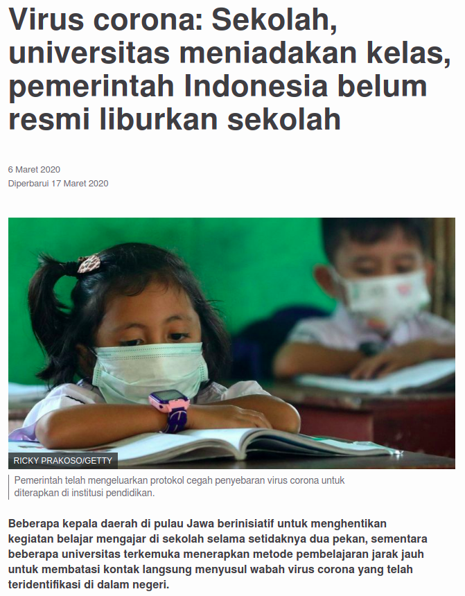
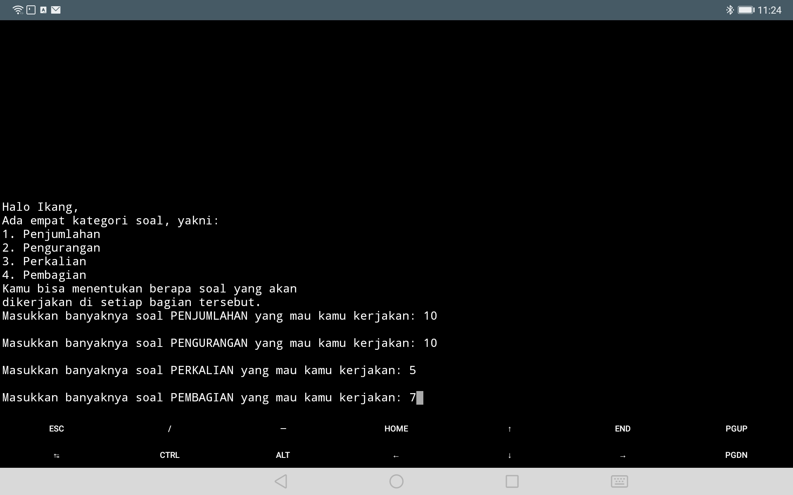
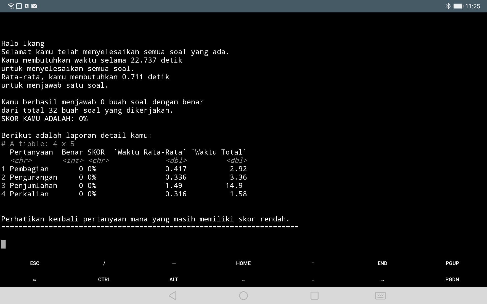

layout: true

<div class="my-footer"><span>Proposal RBL</span></div>

```{r setup, include=FALSE}
options(htmltools.dir.version = FALSE)
```

---

class: middle,center,inverse

# PENDAHULUAN

---
class: center

```{r out.width="40%",echo=FALSE,fig.align='center'}

```

https://www.bbc.com/indonesia/indonesia-51769074

---
# PENDAHULUAN

## Latar Belakang

Pandemi mengakibatkan hampir semua sekolah ditutup. Baik dari tingkat SD hingga perguruan tinggi. Akibatnya orang tua harus mengambil peran sebagai guru yang bertugas untuk:

- Mengajarkan
- Memberi evaluasi

> Anak SD di kelas 3 - 4 diharapkan sudah bisa mengerjakan soal penambahan, pengurangan, perkalian, dan pembagian yang sederhana. 

--

## Masalah
Dalam hal memberikan evaluasi, beberapa masalah yang muncul antara lain:

- Buku latihan yang terbatas.
- Keterbatasan guru maupun orang tua dalam mengecek pekerjaan siswa (edweek.com).
- Tingginya distraksi dari aktivitas lain seperti video game terutama untuk generasi _alpha_ yang sangat _fluent_ terhadap teknologi.

---

class: middle, center

# Siapa Generasi _Alpha_?

## Generasi alpha (2011 – 2025) generasi yang paling akrab dengan teknologi digital  dan  generasi  yang  diklaim  paling  cerdas  dibandingkan generasi  generasi  sebelumnya. (McCrandle, 2020).

---
class:middle

# PENDAHULUAN

## TUJUAN 

Oleh karena itu, program ini dibuat agar anak bisa mendapatkan soal latihan berhitung yang di-_generate_ secara _random_ dan __otomatis__ dengan __tingkat kesulitan soal dapat disesuaikan__. Sehingga akan tercipta soal latihan yang __tidak terbatas jumlahnya__. Awalnya mungkin akan terlihat seperti mengerjakan _game_ di komputer.

---
class:middle
# METODE

## _Resources_ yang Diperlukan
Untuk membuat program ini, diperlukan beberapa _resources_ dan prinsip komputasi seperti:

- _Function_. 
  - Digunakan untuk membuat _generator_ soal dan beberapa __notifikasi__ lainnya.
- _Looping_. 
  - Digunakan untuk memanggil fungsi soal tergantung _input_ dari _user_.
- _Conditional_. 
  - Digunakan untuk menghitung jawaban benar dan mengatur level kesulitan soal.
- _Menyimpan data_. 
- _Visualisasi data_.

---
class:middle
# _FRAMEWORKS_

```{r out.width="100%",echo=FALSE,message=FALSE,warning=FALSE,fig.align='center'}
nomnoml::nomnoml("
                 [Masalah] -> [Tujuan]
                 [Tujuan] -> [Input]
                 [Input] -> [Proses]
                 [Proses] -> [Output]
                 
                 [Tujuan|
                    Membuat program\ngenerator soal]
                 
                 [Masalah|
                    Keterbatasan dalam membuat\nsoal penjumlahan, pengurangan,\nperkalian, dan pembagian. 
                    ]
                 
                 [Input|
                    [User] -> [Nama]
                    [User] -> [Level\nsoal]
                    [User] -> [Banyak\nsoal]
                    ]
                 
                 [Output|
                    [Rekap\nJawaban] -> [Text output]
                    [Rekap\nJawaban] -> [Tabel]
                    [Rekap\nJawaban] -> [Plot report]
                    ]
                 
                 [Proses|
                    [Looping] -> [Generate\nSoal]
                    [Generate\n Soal] -> [User\nmenjawab]
                    [User\nmenjawab] -> [T]
                    [User\nmenjawab] -> [F]
                    ]  
                 "
                 )
```

---
class:middle
# CONTOH _FUNCTION_

.pull-left[

## Penjumlahan

```
import datetime

def jumlah(x1,x2) :
  a = randint(x1,x2)
  b = randint(x1,x2)
  c = a + b
  print(a, ' + ', b, ' = ')
  now = datetime.datetime.now()
  jawab = input('jawab: ')
  now = datetime.datetime.now()
  time_delta = end-now
  total_waktu = time_delta.total_seconds()
  jawab = int(jawab)
  if c == jawab :
     cek = 1
     print(cek)
  else :
     cek = 0
     print(cek)

```

]

.pull-left[

## Level Kesulitan Soal

Level kesulitan soal akan ditentukan oleh batas `x1` dan `x2` sesuai dengan banyaknya digit yang dipelajari oleh anak di kelasnya.

## Waktu Menjawab

Waktu menjawab setiap soal akan dihitung dan dijadikan suatu pengukuran di _report_ kelak.

## Jawaban Benar

Variabel `cek` akan menjadi _key variable_ untuk mengetahui berapa banyak soal yang dijawab dengan benar.

]

---
class:middle

# _MOCK UP_

## Penentuan Banyaknya Soal

```{r out.width="70%",echo=FALSE,fig.align='center'}

```

---
class:middle

# _MOCK UP_

## _Results_

```{r out.width="70%",echo=FALSE,fig.align='center'}

```

---
class:middle

# _MOCK UP_

## _Graphical Results_

```{r,echo=FALSE,message=FALSE,warning=FALSE,fig.height=5,fig.width=15}
rm(list=ls())

library(dplyr)
library(ggplot2)
library(ggpubr)

data = data.frame(n = sample(0:1,50,replace = T,prob = c(.4,.6)),
                  tipe = sample(c("Penjumlahan","Pengurangan","Perkalian","Pembagian"),
                                50,replace = T),
                  waktu = runif(50,5,15))

gr1 = 
  data %>% 
  group_by(tipe) %>% 
  summarise(benar = sum(n),
            total_soal = length(n),
            mean_time = mean(waktu),
            total_waktu = sum(waktu)) %>% 
  ungroup()

plt1 = 
  gr1 %>% 
  mutate(tipe = paste0(tipe,"\nTotal Soal: ",total_soal),
         persen = benar/total_soal*100,
         persen = round(persen,1),
         label = paste0(tipe,"\n",persen,"%")) %>% 
  ggplot(aes(x = reorder(tipe,-persen),
             y = persen)) +
  geom_col(color = "steelblue",
           aes(fill = persen)) +
  geom_label(aes(label = label)) +
  scale_fill_gradient2(min = "red",high = "darkgreen", midpoint = 50) +
  theme_minimal() +
  theme(axis.title = element_blank(),
        axis.text = element_blank()) +
  labs(title = "Skor Total per Tipe Pertanyaan",
       fill = "Skor") +
  coord_polar()

plt2 = 
  gr1 %>% 
  mutate(tipe = paste0(tipe,"\nTotal Soal: ",total_soal),
         persen = round(mean_time,1),
         label = paste0(persen,"'s")) %>% 
  ggplot(aes(x = reorder(tipe,persen),
             y = persen)) +
  geom_col(color = "steelblue",
           fill = "white") +
  geom_label(aes(label = label)) +
  theme_minimal() +
  theme(axis.title = element_blank(),
        axis.text.x = element_blank()) +
  labs(title = "Waktu Rata-Rata per Tipe Pertanyaan") +
  coord_flip()

plt3 = 
  data %>% 
  mutate(benar = cumsum(n),
         waktu = cumsum(waktu)) %>% 
  mutate(benar = benar / 50*100) %>% 
  ggplot(aes(x = waktu,
             y = benar)) +
  geom_line(group = 1,
            color = "steelblue") +
  geom_text(aes(label = benar),
            size = 3,
            alpha = .4) +
  theme_minimal() +
  labs(y = "SKOR",
       x = "Waktu Pengerjaan Soal (dalam detik)",
       title = "Skor yang Didapatkan Peserta") +
  theme(axis.text.y = element_blank())

obj1 = ggarrange(plt2,plt3,ncol = 1,nrow = 2)
ggarrange(plt1,obj1,ncol = 2,nrow = 1,widths = c(2,1))
```

---
class: middle,center,inverse

# Terima Kasih
## _Feel free to discuss_